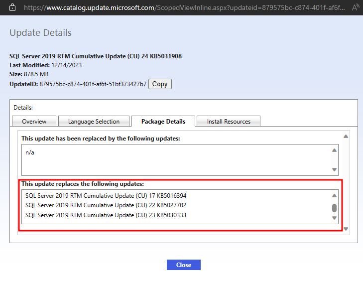

# Centra

A collection of sites related to cybersecurity.

> [!WARNING]
> The domains could be changed or compromised over time. You may visit the links at your own risk.

# ToC

- [Practice Environments](#practice-environments)
- [Vulnerabilities](#vulnerabilities)
- [Patching Vulnerabilities](#patching-vulnerabilities)
- [Red Team](#red-team)
- [Blue Team](#blue-team)
- [Hardening and Compliance](#hardening-and-compliance)
- [Reverse Engineering](#reverse-engineering)
- [Secure Coding](#secure-coding)
- [Web Security](#web-security)
- [Exploit Development](#exploit-development)
- [Evasion](#evasion)
- [Living Off The Land](#living-off-the-land)
- [Notes](#notes)
- [Cheatsheets](#cheatsheets)
- [Website Articles / Blogs](#website-articles--blogs)
- [Mindmaps](#mindmaps)
- [Whitepapers](#whitepapers)
- [Reporting](#reporting)
- [Reporting Vulnerabilities](#reporting-vulnerabilities)

# Practice Environments

Practice in vulnerable labs:
- https://github.com/kaiiyer/awesome-vulnerable
- https://github.com/Orange-Cyberdefense/GOAD
- https://docs.google.com/spreadsheets/u/0/d/1dwSMIAPIam0PuRBkCiDI88pU3yzrqqHkDtBngUHNCw8/htmlview?pli=1

Learn about vulnerable code:
- https://github.com/snoopysecurity/Vulnerable-Code-Snippets
- https://github.com/yeswehack/vulnerable-code-snippets
- https://github.com/Yavuzlar/VulnLab
- https://github.com/digininja/DVWA

# Vulnerabilities

Latest vulnerabilities:
- https://github.com/CVEProject/cvelistV5/releases
- https://www.cvedetails.com/browse-by-date.php
- https://www.tenable.com/cve/newest
- https://github.com/projectdiscovery/cvemap
- https://blog.qualys.com/vulnerabilities-threat-research
- https://hackerone.com/hacktivity/cve_discovery
- https://nvd.nist.gov/developers
- https://www.cisa.gov/known-exploited-vulnerabilities-catalog

0-day tags:
- https://packetstormsecurity.com/news/tags/zero_day/

Receiving notifications of GitHub releases:
- https://stackoverflow.com/a/49350626
- https://docs.github.com/en/account-and-profile/managing-subscriptions-and-notifications-on-github/setting-up-notifications/configuring-notifications

CNA List:
- https://www.cve.org/ProgramOrganization/CNAs

EoL references:
- https://endoflife.date/
- https://learn.microsoft.com/en-us/lifecycle/
- https://access.redhat.com/product-life-cycles

Exploit sites:
- https://www.exploit-db.com/
- https://www.rapid7.com/db/
- https://packetstormsecurity.com/files/tags/exploit/

PoC collections (WARNING: Some "PoC" may have malware):
- https://github.com/trickest/cve
- https://github.com/nomi-sec/PoC-in-GitHub/

Vulnerability databases
- https://nvd.nist.gov/vuln
- https://security.snyk.io/

CVE sites:
- https://github.com/CVEProject
- https://cveproject.github.io/
- https://cve.mitre.org/

VPR:
- https://docs.tenable.com/nessus/Content/RiskMetrics.htm

CVSS:
- https://www.first.org/cvss/v4-0/
- https://www.first.org/cvss/v3-1/
- https://www.first.org/cvss/v3-0/
- https://www.first.org/cvss/v2/
- https://www.first.org/cvss/v1/

Vulnerability references:
- https://msrc.microsoft.com/update-guide/vulnerability
- https://ubuntu.com/security/cves
- https://access.redhat.com/security/vulnerabilities

Vulnerability files:
- https://packetstormsecurity.com/files/

# Patching Vulnerabilities

Security Advisories and Update Guides:
- https://learn.microsoft.com/en-us/security-updates/securitybulletins/securitybulletins
- https://msrc.microsoft.com/update-guide/
- https://ubuntu.com/security/cves
- https://access.redhat.com/security/security-updates/cve
- https://access.redhat.com/security/security-updates/security-advisories
- https://www.veeam.com/knowledge-base.html
- https://www.vmware.com/security/advisories.html
- https://www.dell.com/support/security/en-us
- https://sec.cloudapps.cisco.com/security/center/publicationListing.x
- https://www.cisco.com/c/en/us/support/security/identity-services-engine/products-security-advisories-list.html
- https://packetstormsecurity.com/files/tags/advisory/
- https://www.cisa.gov/news-events/cybersecurity-advisories
- https://technet.microsoft.com/security/advisory
- https://www.sophos.com/en-us/security-advisories
- https://www.fortiguard.com/psirt
- https://security.paloaltonetworks.com/

> **Note**: Security advisories and update guides can be used to find remediations, mitigations, and/or workarounds for specific products and/or software. It also details which products and/or software are affected by a specific vulnerability. It is recommended to review the advisories of a vendor when performing vulnerability assessments, penetration tests, red team engagements, or for reporting in general.

Microsoft Update Catalog:
- https://www.catalog.update.microsoft.com/home.aspx

Microsoft Update Definitions:
- https://learn.microsoft.com/en-us/troubleshoot/windows-client/deployment/standard-terminology-software-updates

Microsoft KB (example):
- https://support.microsoft.com/en-us/topic/december-12-2023-kb5033375-os-builds-22621-2861-and-22631-2861-90f983aa-efb6-4caa-9cab-7e5cfa00ed36

Microsoft CU Updates (replaces previous KBs):
- https://learn.microsoft.com/en-us/troubleshoot/sql/releases/sqlserver-2019/cumulativeupdate24

Screenshot of Update ID (879575bc-c874-401f-af6f-51bf373427b7):

Unix/Linux-based Updates:
- https://ubuntu.com/security/notices
- https://access.redhat.com/security/security-updates/

# Red Team

MITRE ATT&CK:
- https://attack.mitre.org/
- https://mitre-attack.github.io/attack-navigator/

Red team tactics:
- https://github.com/redcanaryco/atomic-red-team/blob/master/atomics/  
- https://atomicredteam.io/atomics/
- https://github.com/A-poc/RedTeam-Tools
- https://github.com/center-for-threat-informed-defense
- https://redteamrecipe.com/  
- https://book.redteamguides.com/
- https://github.com/LuemmelSec/Pentest-Tools-Collection#obfuscation
- https://github.com/RistBS/Awesome-RedTeam-Cheatsheet
- https://github.com/h3ll0clar1c3/CRTO
- https://github.com/J0hnbX/RedTeam-Resources
- https://hacklido.com/t/red-teaming

Practice Red Team Ops:
- https://github.com/bluscreenofjeff/Red-Team-Infrastructure-Wiki
- https://github.com/WesleyWong420/RedTeamOps-Havoc-101
- https://github.com/dmcxblue/Red-Team-Guide?tab=readme-ov-file
- https://tryhackme.com/path/outline/redteaming

OPSEC:
- https://github.com/WesleyWong420/OPSEC-Tradecraft
- https://github.com/Lissy93/personal-security-checklist
- https://labs.nettitude.com/blog/creating-an-opsec-safe-loader-for-red-team-operations/
- https://github.com/OffcierCia/Crypto-OpSec-SelfGuard-RoadMap

OSINT:
- https://github.com/OffcierCia/non-typical-OSINT-guide
- https://github.com/jivoi/awesome-osint
- https://github.com/OhShINT/ohshint.gitbook.io

Adversary emulation platforms:
- https://github.com/mitre/caldera
- https://github.com/FourCoreLabs/firedrill
- https://www.encripto.no/en/downloads-2/tools/

C2 Matrixes:
- https://howto.thec2matrix.com/
- https://github.com/outflanknl/C2-Tool-Collection

# Blue Team

MITRE D3FEND:
- https://d3fend.mitre.org/

Blue team tactics:
- https://github.com/A-poc/BlueTeam-Tools
- https://book.blueteamguides.com/
- https://github.com/fabacab/awesome-cybersecurity-blueteam
- https://github.com/rshipp/awesome-malware-analysis
- https://github.com/paralax/awesome-honeypots
- https://github.com/meirwah/awesome-incident-response
- https://github.com/hslatman/awesome-threat-intelligence
- https://github.com/InQuest/awesome-yara
- https://github.com/cugu/awesome-forensics
- https://github.com/kai5263499/container-security-awesome 
- https://github.com/sroberts/awesome-iocs
- https://github.com/meirwah/awesome-incident-response
- https://github.com/tylerha97/awesome-reversing
- https://github.com/cyb3rxp/awesome-soc
- https://github.com/nasbench/SIGMA-Resources
- https://hacklido.com/t/blue-teaming
- https://cyberblueteam.medium.com/

Latest threats:
- https://threatfeeds.io/

IP Information:
- https://ipchicken.com/
- https://ipgeolocation.io/
- https://www.abuseipdb.com/

URL Information:
- https://www.urlvoid.com/

SIGMA:
- https://github.com/SigmaHQ/sigma
- https://github.com/SigmaHQ/pySigma

Yara:
- https://github.com/Yara-Rules/rules
- https://yara-rules.github.io/blog/

OSSEC:
- https://github.com/ossec/ossec-rules/tree/master

Custom Rules:
- https://documentation.wazuh.com/current/user-manual/ruleset/custom.html

XDR Rules:
- https://learn.microsoft.com/en-us/microsoft-365/security/defender/custom-detection-rules?view=o365-worldwide

Detection Sites:
- https://detection.fyi/

Parkerian Hexad:
- https://en.wikipedia.org/wiki/Parkerian_Hexad

Logs references:
- https://www.rfc-editor.org/rfc/rfc5424
- https://www.ultimatewindowssecurity.com/

Sysmon references:
- https://learn.microsoft.com/en-us/sysinternals/downloads/sysmon
- https://github.com/Sysinternals/SysinternalsEBPF
- https://github.com/Sysinternals/SysmonForLinux
- https://github.com/SwiftOnSecurity/sysmon-config
- https://www.youtube.com/watch?v=kESndPO5Fig&list=PLk-dPXV5k8SG26OTeiiF3EIEoK4ignai7
- https://github.com/trustedsec/SysmonCommunityGuide
- https://github.com/trustedsec/SysmonCommunityGuide/blob/master/chapters/install_windows.md#installation-best-practice

IANA: 
- https://www.iana.org/domains/root/servers

Email: 
- https://mxtoolbox.com/
- https://easydmarc.com/tools/domain-scanner

DNS: 
- https://viewdns.info/
- https://dnsdumpster.com/
- https://dnsspy.io/scan
- https://dnschecker.org/reverse-dns.php
- https://www.nslookup.io/
- https://www.whatsmydns.net/
- https://hackertarget.com/zone-transfer/

Certificates Information: 
- https://crt.sh/

Website Information: 
- https://sitereport.netcraft.com/

# Hardening and Compliance

Hardening Papers:
- https://hdm.io/writing/Mitigating%20Service%20Account%20Credential%20Theft%20on%20Windows.pdf

Projects:
- https://github.com/decalage2/awesome-security-hardening

Implement hardening in infrastructure:
- https://github.com/decalage2/awesome-security-hardening
- https://www.cisecurity.org/cis-benchmarks
- https://www.sans.org/information-security-policy/
- https://github.com/SpecterOps/TierZeroTable/

Zero trust:
- https://www.microsoft.com/en-us/security/business/zero-trust
- https://csrc.nist.gov/pubs/sp/800/207/final
- https://csrc.nist.gov/pubs/sp/1800/35/3prd

Security Baselines:
- https://learn.microsoft.com/en-us/windows/security/operating-system-security/device-management/windows-security-configuration-framework/windows-security-baselines
- https://techcommunity.microsoft.com/t5/microsoft-security-baselines/bg-p/Microsoft-Security-Baselines

Assessment and Auditing Tools:
- https://www.nist.gov/cyberframework/assessment-auditing-resources
- https://github.com/CISOfy/lynis

Cybersecurity evaluation tools:
- CISA CSET: https://www.cisa.gov/downloading-and-installing-cset
- HIPAA: https://www.healthit.gov/topic/privacy-security-and-hipaa/security-risk-assessment-tool

Compliance tools:
- https://www.microsoft.com/en-us/download/details.aspx?id=55319
- https://ubuntu.com/security/certifications/docs/16-18/cis/compliance
- https://github.com/Microsoft/PowerStig/wiki/
- https://public.cyber.mil/stigs/stig-viewing-tools/

Compliance CSF references:
- https://csf.tools/reference/nist-cybersecurity-framework/v1-1/
- https://csf.tools/reference/nist-sp-800-53/

Compliance Frameworks:
- PCI-DSS: https://www.pcisecuritystandards.org/
- HIPAA: https://www.hhs.gov/hipaa/for-professionals/index.html
- ISO: https://www.iso.org/home.html
- NIST: https://www.nist.gov/
- Other: https://www.rapid7.com/fundamentals/compliance-regulatory-frameworks/

NIST framework publications:
- Cybersecurity Framework: https://www.nist.gov/cyberframework
- NIST 800-171: https://csrc.nist.gov/pubs/sp/800/171/r2/upd1/final
- NIST 800-53: https://csrc.nist.gov/pubs/sp/800/53/r5/upd1/final

NIST Computer Security Resource Center (CSRC):
- https://csrc.nist.gov/

NIST CSRC FIPS:
- https://csrc.nist.gov/publications/fips

NIST CSRC SP:
- https://csrc.nist.gov/publications/sp

CIS:
- https://www.cisecurity.org

SCuBA:
- https://www.cisa.gov/resources-tools/services/secure-cloud-business-applications-scuba-project
- https://github.com/cisagov/ScubaGear

DISA STIG:
- https://public.cyber.mil/stigs/

Compliance documents:
- https://stigviewer.com/

Risk Management:
- https://www.nist.gov/risk-management
- https://csrc.nist.gov/pubs/sp/800/39/final
- https://github.com/cingulara/openrmf-docs/

# Reverse Engineering

Reversing:
- https://github.com/HACKE-RC/awesome-reversing
- https://github.com/mytechnotalent/Reverse-Engineering
- https://0xinfection.github.io/reversing/
- https://guyinatuxedo.github.io/index.html

# Secure Coding

Secure coding articles:
- https://owasp.org/www-project-secure-coding-practices-quick-reference-guide/stable-en/01-introduction/05-introduction
- https://snyk.io/learn/secure-coding-practices/
- https://developers.redhat.com/topics/secure-coding

Development guides:
- https://github.com/cisagov/development-guide

# Web Security

Web General:
- https://github.com/EdOverflow/bugbounty-cheatsheet/tree/master

Certificates Information:
- https://certlogik.com/decoder/

# Exploit Development

Exploit development:
- https://exploitation.ashemery.com/
- https://www.corelan.be/
- https://exploit.courses/#/index

# Evasion

Win32 API:
- https://github.com/microsoft/CsWin32
- https://github.com/microsoft/cppwinrt
- https://github.com/microsoft/windows-rs
- https://pinvoke.net/

Syscalls:
- https://offensivedefence.co.uk/posts/dinvoke-syscalls/

Blinding Sysmon:
- https://tierzerosecurity.co.nz/2024/03/27/blind-edr.html
- https://codewhitesec.blogspot.com/2022/09/attacks-on-sysmon-revisited-sysmonente.html

Shellcoding:
- https://axcheron.github.io/linux-shellcode-101-from-hell-to-shell/
- https://xacone.github.io/custom_shellcode.html

Hiding Stuff:
- https://attl4s.github.io/assets/pdf/UNDERSTANDING_AND_HIDING_YOUR_OPERATIONS.pdf

Malware Development Basics:
- https://otterhacker.github.io/Malware/Introduction/0%20-%20Introduction.html
- https://d3ext.github.io

Bypass AV/EDR summary:
- https://matro7sh.github.io/BypassAV/
- https://luemmelsec.github.io/Circumventing-Countermeasures-In-AD/
- https://synzack.github.io/Blinding-EDR-On-Windows/
- https://s3cur3th1ssh1t.github.io/A-tale-of-EDR-bypass-methods/

Shellcoding:
- https://xacone.github.io/custom_shellcode.html

Windows API:
- https://noelit911.github.io/Introduction-to-the-Windows-API/#
- https://learn.microsoft.com/en-us/windows/win32/apiindex/windows-api-list
- https://learn.microsoft.com/en-us/windows/win32/apiindex/windows-apisets

Bypass AMSI:
- https://rxored.github.io/post/csharploader/bypassing-amsi-with-csharp/
- https://ret2desync.github.io/using-msbuild-bypass-powershell-clm-amsi-scriptlogging/
- https://icyguider.github.io/2021/07/21/Bypass-AMSI-via-PowerShell-with-Zero-Effort.html

Process Hollowing:
- https://rxored.github.io/post/malware/process-hollowing/process-hollowing/
- https://alexfrancow.github.io/red-team/OffensiVe-Security-with-V-2-Process-Hollowing/
- https://alexfrancow.github.io/red-team/OffensiVe-Security-with-V-Shellcode-Execution/
- https://alexfrancow.github.io/red-team/OffensiVe-Security-with-V-3-XOR/
- https://alexfrancow.github.io/red-team/OffensiVe-Security-with-V-4-Caesar/

Under Radar:
- https://crypt0ace.github.io/posts/Staying-under-the-Radar/
- https://crypt0ace.github.io/posts/Staying-under-the-Radar-Part-2/
- https://crypt0ace.github.io/posts/Staying-under-the-Radar-Part-3/

Shellcode Injection:
- https://noelit911.github.io/Payload-Unleashed-Shellcode-Injection/

COFF Loader:
- https://otterhacker.github.io/Malware/CoffLoader.html

APC Injection:
- https://noelit911.github.io/Payload-Unleashed-APC-Injection/

DLL Injection:
- https://noelit911.github.io/Payload-Unleashed-DLL-Injection/
- https://skr1x.github.io/reflective-loading-portable-executable-memory/
- https://xacone.github.io/remote-reflective-dll-injection.html
- https://otterhacker.github.io/Malware/Remote%20DLL%20Injection.html
- https://otterhacker.github.io/Malware/Reflective%20DLL%20injection.html

DLL Sideloading:
- https://github.com/georgesotiriadis/Chimera
- https://www.redpacketsecurity.com/chimera-automated-dll-sideloading-tool-with-edr-evasion-capabilities/
- https://www.crowdstrike.com/blog/dll-side-loading-how-to-combat-threat-actor-evasion-techniques/

ETW:
- https://otterhacker.github.io/Malware/ETW.html
- https://whiteknightlabs.com/2021/12/11/bypassing-etw-for-fun-and-profit/
- https://thewover.github.io/Cruller/
- https://0xstarlight.github.io/posts/Bypassing-Windows-Defender/
- https://benjitrapp.github.io/attacks/2024-02-11-offensive-etw/
- https://reprgm.github.io/2023/08/30/lets-make-malware-part-11/
- https://lougerard.github.io/me/posts/THM-monitoringevasion/
- https://damonmohammadbagher.github.io/Posts/11Feb2021x.html

Function Hooking:
- https://otterhacker.github.io/Malware/Function%20hooking.html

Kernel Callback:
- https://otterhacker.github.io/Malware/Kernel%20callback.html

Module Stomping:
- https://otterhacker.github.io/Malware/Module%20stomping.html

Bypass AV/EDR/MDR/XDR software:
- https://avred.r00ted.ch/
- https://github.com/dobin/avred
- https://github.com/netero1010/EDRSilencer
- https://github.com/myzxcg/RealBlindingEDR
- https://github.com/wavestone-cdt/EDRSandblast
- https://github.com/klezVirus/inceptor/

Bypass AV/EDR/MDR/XDR articles:
- https://book.hacktricks.xyz/windows-hardening/av-bypass
- https://luemmelsec.github.io/Circumventing-Countermeasures-In-AD/
- https://blog.scrt.ch/category/antivirus/
- https://blog.xpnsec.com/anti-debug-openprocess/
- https://medium.com/@0xHossam

Bypass AV/EDR/MDR/XDR learning:
- https://github.com/reveng007/Learning-EDR-and-EDR_Evasion

# Living Off The Land

LOL:
- https://lolol.farm/
- https://br0k3nlab.com/LoFP/
- https://loldrivers.io/
- https://gtfobins.github.io/
- https://lolbas-project.github.io/
- https://lots-project.com/
- https://filesec.io/
- https://malapi.io/
- https://hijacklibs.net/
- https://wadcoms.github.io/
- https://www.loobins.io/
- https://lolapps-project.github.io/
- https://www.bootloaders.io/
- https://www.mandiant.com/resources/blog/bring-your-own-land-novel-red-teaming-technique
- https://lothardware.com.tr/
- https://wtfbins.wtf/
- https://lofl-project.github.io/
- https://persistence-info.github.io/
- https://github.com/WithSecureLabs/lolcerts

# Notes

Collection of notes:
- https://book.redteamguides.com/
- https://book.hacktricks.xyz/welcome/readme
- https://github.com/swisskyrepo/PayloadsAllTheThings
- https://swisskyrepo.github.io/PayloadsAllTheThingsWeb/
- https://github.com/swisskyrepo/InternalAllTheThings
- https://swisskyrepo.github.io/InternalAllTheThings/
- https://github.com/swisskyrepo/HardwareAllTheThings
- https://swisskyrepo.github.io/HardwareAllTheThings/
- https://www.thehacker.recipes/
- https://www.ired.team/
- https://ppn.snovvcrash.rocks/
- https://dmcxblue.gitbook.io/red-team-notes-2-0

# Cheatsheets

Collection of cheat sheets:
- https://github.com/ivan-sincek/penetration-testing-cheat-sheet
- https://github.com/ivan-sincek/ios-penetration-testing-cheat-sheet
- https://github.com/ivan-sincek/android-penetration-testing-cheat-sheet
- https://github.com/ivan-sincek/wifi-penetration-testing-cheat-sheet
- https://github.com/drak3hft7/Cheat-Sheet---Active-Directory
- https://github.com/Kyuu-Ji/Awesome-Azure-Pentest
- https://github.com/S1ckB0y1337/Active-Directory-Exploitation-Cheat-Sheet
- https://hideandsec.sh/books/cheatsheets-82c/page/active-directory
- https://github.com/riramar/Web-Attack-Cheat-Sheet
- https://github.com/payloadbox/xss-payload-list
- https://github.com/payloadbox/command-injection-payload-list
- https://github.com/payloadbox/sql-injection-payload-list
- https://github.com/payloadbox/open-redirect-payload-list
- https://github.com/payloadbox/xxe-injection-payload-list
- https://github.com/payloadbox/rfi-lfi-payload-list
- https://github.com/payloadbox/directory-payload-list
- https://github.com/payloadbox/open-redirect-payload-list
- https://github.com/payloadbox/ssti-payloads
- https://github.com/payloadbox/csv-injection-payloads
- https://github.com/saisathvik1/OSCP-Cheatsheet
- https://github.com/saisathvik1/Linux-Privilege-Escalation-Notes
- https://github.com/saisathvik1/Windows-Privilege-Escalation-Notes
- https://0x4rt3mis.github.io/posts/OSEP-Cheat-Sheet/
- https://github.com/chvancooten/OSEP-Code-Snippets 
- https://github.com/We5ter/Scanners-Box
- https://github.com/sinfulz/JustEvadeBro
- https://www.sans.org/blog/the-ultimate-list-of-sans-cheat-sheets/

# Website Articles / Blogs

Nice websites to read:
- https://packetstormsecurity.com/
- https://www.zerodayinitiative.com/blog/
- https://atomicredteam.io/
- https://blog.whiteflag.io/
- https://specterops.io/blog/
- https://trustedsec.com/research
- https://www.blackhillsinfosec.com/blog/
- https://www.sentinelone.com/blog/
- https://blog.scrt.ch/
- https://outflank.nl/blog/
- https://starlabs.sg/blog/
- https://tmpout.sh/
- https://s3cur3th1ssh1t.github.io/
- https://luemmelsec.github.io/
- https://blog.xpnsec.com/
- https://aadinternals.com/
- https://zxsecurity.co.nz/research
- https://www.riskinsight-wavestone.com/en/
- https://pentestlab.blog/
- https://thecontractor.io/
- https://shorsec.io/blog/
- https://dirkjanm.io/
- https://assume-breach.medium.com/
- https://0xsp.com/
- https://sokarepo.github.io/
- https://magisterquis.github.io/
- https://0xdf.gitlab.io
- https://offsec.almond.consulting/
- https://hideandsec.sh
- https://zer1t0.gitlab.io
- https://harmj0y.medium.com
- https://redsiege.com/red-siege-blog/
- https://www.hackthebox.com/blog/
- https://xacone.github.io/
- https://blog.redteam-pentesting.de/
- https://ipurple.team/
- https://sec-consult.com/blog/
- https://redfoxsec.com/blog/
- https://labs.nettitude.com/blog/
- https://www.netero1010-securitylab.com/
- https://cymulate.com/blog/
- https://synzack.github.io/
- https://frischkorn-nicholas.medium.com/
- https://douggemhax.wordpress.com/
- https://medium.com/@matterpreter
- https://www.matteomalvica.com/blog
- https://br-sn.github.io/
- https://de-engineer.github.io/
- https://malwaretech.com/
- https://www.elastic.co/blog/
- https://rxored.github.io/page/4/
- https://klezvirus.github.io/
- https://alexfrancow.github.io/
- https://crypt0ace.github.io/
- https://noelit911.github.io/
- https://attl4s.github.io/
- https://hdm.io/
- https://osandamalith.com/

Nice system administrator websites:
- https://www.informaticar.net/
- https://whackasstech.com/
- https://www.prajwaldesai.com/intune/
- https://joymalya.com/category/microsoft-intune/
- https://www.anoopcnair.com/intune/
- https://www.petervanderwoude.nl/
- https://4sysops.com/archives/
- https://adamtheautomator.com/
- https://www.digitalocean.com/community/tutorials/
- https://www.thelazyadministrator.com/
- https://myronhelgering.com/

Recommended read documentations:
- https://learn.microsoft.com/
- https://learn.microsoft.com/en-us/previous-versions/windows/it-pro/windows-server-2012-r2-and-2012/hh831360(v=ws.11)
- https://learn.microsoft.com/en-us/previous-versions/windows/it-pro/windows-server-2012-R2-and-2012/dn786436(v=ws.11)
- https://learn.microsoft.com/en-us/previous-versions/windows/it-pro/windows-server-2012-R2-and-2012/dn786440(v=ws.11)

Websites about news:
- https://packetstormsecurity.com/news/
- https://arstechnica.com/
- https://www.theregister.com/
- https://www.scmagazine.com/
- https://www.securityweek.com/

Nice articles to read:
- https://zer1t0.gitlab.io/posts/attacking_ad/
- https://medium.com/@br4nsh/from-linux-to-ad-10efb529fae9
- https://hideandsec.sh/books/windows-sNL/page/in-the-potato-family-i-want-them-all
- https://blog.whiteflag.io/blog/exploiting-windows-tokens/
- https://luemmelsec.github.io/Skidaddle-Skideldi-I-just-pwnd-your-PKI/
- https://offsec.almond.consulting/authenticating-with-certificates-when-pkinit-is-not-supported.html
- https://offsec.almond.consulting/ldap-authentication-in-active-directory-environments.html
- https://luemmelsec.github.io/Pentest-Everything-SMTP/
- https://synzack.github.io/Blinding-EDR-On-Windows/
- https://frischkorn-nicholas.medium.com/windows-evasion-edrs-shellcode-loaders-
- https://blog.xpnsec.com/lapsv2-internals/
- https://www.matteomalvica.com/blog/2020/07/15/silencing-the-edr/
- https://br-sn.github.io/Removing-Kernel-Callbacks-Using-Signed-Drivers/

# Mindmaps

Collection of mindmaps:
- https://github.com/Ignitetechnologies/Mindmap/
- https://www.amanhardikar.com/mindmaps/
- https://www.amanhardikar.com/mindmaps/Practice.html
- https://orange-cyberdefense.github.io/ocd-mindmaps/

# Whitepapers

Whitepapers:
- https://packetstormsecurity.com/files/tags/paper/
- https://www.giac.org/research-papers/
- https://www.sans.org/white-papers/
- https://www.cisecurity.org/insights/white-papers
- https://csrc.nist.gov/publications/cswp
- https://www.crowdstrike.com/resources/white-papers/

# Reporting

Reporting software:
- https://docs.sysreptor.com/

Report templates:
- https://github.com/Syslifters/HackTheBox-Reporting
- https://github.com/Syslifters/OffSec-Reporting

Reporting tips:
- https://www.blackhillsinfosec.com/dos-and-donts-of-pentest-report-writing/
- https://www.blackhillsinfosec.com/wp-content/uploads/2023/04/SLIDES_BB_Hacking_Reporting_2023-04.pdf
- https://www.blackhillsinfosec.com/your-reporting-matters-how-to-improve-pen-test-reporting/

# Reporting Vulnerabilities

RFC 9116:
- https://www.rfc-editor.org/rfc/rfc9116

Vulnerability reporting:
- https://docs.hackerone.com/en/articles/8473994-submitting-reports
- https://docs.bugcrowd.com/researchers/reporting-managing-submissions/reporting-a-bug/

CVE Process:
- https://nvd.nist.gov/general/cve-process
- https://cve.mitre.org/CVEIDsAndHowToGetThem.pdf
- https://cveproject.github.io/docs/content/key-details-phrasing.pdf

CNA:
- https://www.cve.org/PartnerInformation/ListofPartners
